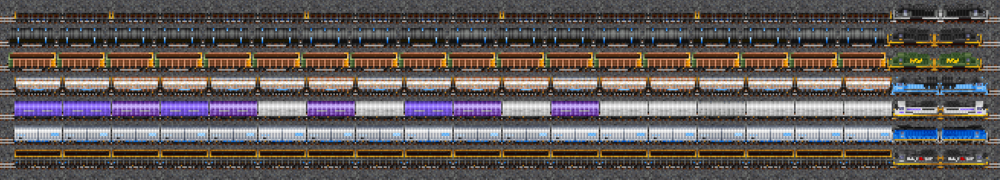

# Lemurian NARS Addon 2CC

[Changelog](./CHANGELOG.md) / [All Liveries](./TRAINS.md)




No original locomotives, but it does offer a variety of liveries for some
locomotives, from fictional ones, to real-life railroads and even all-black
paint schemes (SDP40).

## Copyright

This NewGRF contains modified versions of sprites from the NARS Add-On
Set. The NARS Add-On Set's credits are here below:

```
■■■■■■■■■■■■■■■■■■■■■■■■■■■■■■■■■■■■■■■
4. CREDITS
■■■■■■■■■■■■■■■■■■■■■■■■■■■■■■■■■■■■■■■
These are the people who helped to make
the "NARS Add-On Set" possible

CODE : Nekomaster and Transport Man

GRFX : Emporer Jake, Packer/Pack Man, DanMack,
PikkaBird, Paulicus25, NekoMaster,
Voyager One, Engine97

(Let me, nekomaster, know if I've missed
anyone in the credits!)

Thanks to Engine97 for being the first
contributer of new graphics!
2-8-8-8-2 Triplex!

Thanks to Pikkabird and DanMack for
letting me use NARS 1 and 2 sprites

Thanks to Krtaylor from the US Set for
letting me use sprites from the
US Train Set.

A special thanks to Slyf for helping me
figure out how to code my own NML GRF's
```

Sprites with custom liveries by Lemuria.

<hr>