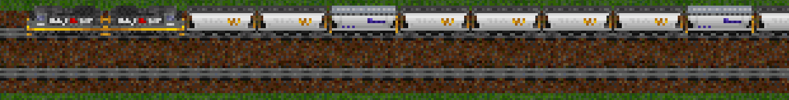
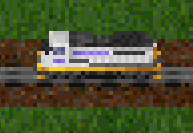
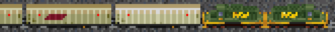
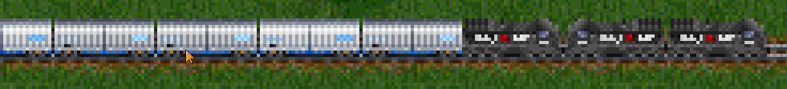

[< Back](./README.md)

## Locomotives
### SD70ACe

"Fictional 1" livery SD70ACe hauling cylindrical hoppers

 
"Fictional 2" livery SD70ACe. Primary color white, secondary color purple.

### SDP40
 
SDP40 in a completely black paint scheme.

### SD40
 
Green SNIM locomotives hauling some iron ore through the desert. SD40 Generic 1, primary dark green, secondary yellow.

 
Two more green SNIM locomotives.

### ES40DC
 
"Monocolor" livery ES40DC in a rail yard.

 
"Fictional 1" livery ES40DC hauling refrigerated cars

### SD75i
 
Monocolor SD75i running freight through a city

